# MEI test set
This is an autogenerated overview of the testfiles.
### [dotted-4.mei](MEI-test-set/MEI/chords/dotted-4.mei)
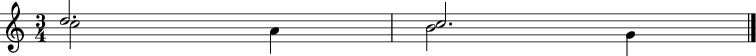

### [unisons-5.mei](MEI-test-set/MEI/chords/unisons-5.mei)

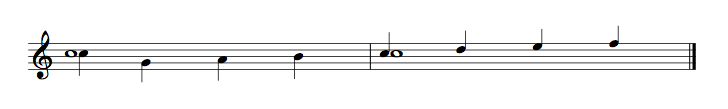
### [cluster-chords-3.mei](MEI-test-set/MEI/chords/cluster-chords-3.mei)
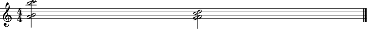

### [shared-note-heads.mei](MEI-test-set/MEI/chords/shared-note-heads.mei)
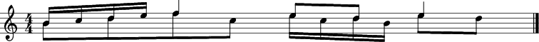

### [cluster-chords-whole-notes.mei](MEI-test-set/MEI/chords/cluster-chords-whole-notes.mei)
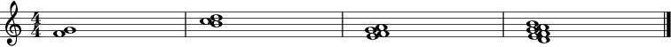
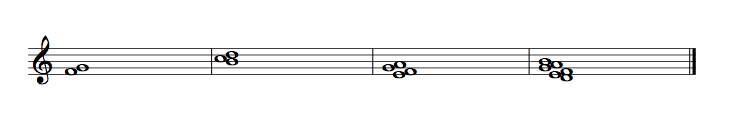
### [unisons-3.mei](MEI-test-set/MEI/chords/unisons-3.mei)

### [dotted-2.mei](MEI-test-set/MEI/chords/dotted-2.mei)

### [unisons-accidentals.mei](MEI-test-set/MEI/chords/unisons-accidentals.mei)
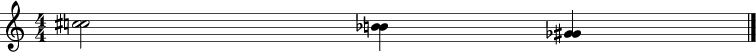
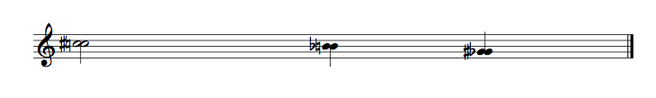
### [cluster-chords-stem-directions.mei](MEI-test-set/MEI/chords/cluster-chords-stem-directions.mei)

### [cluster-chords.mei](MEI-test-set/MEI/chords/cluster-chords.mei)
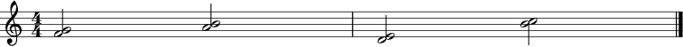

### [stem-directions.mei](MEI-test-set/MEI/chords/stem-directions.mei)
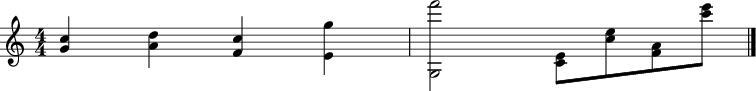

### [unisons-2.mei](MEI-test-set/MEI/chords/unisons-2.mei)

### [chord-test.mei](MEI-test-set/MEI/chords/chord-test.mei)
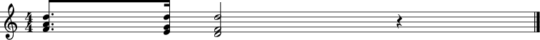

### [crossing-stems-2.mei](MEI-test-set/MEI/chords/crossing-stems-2.mei)
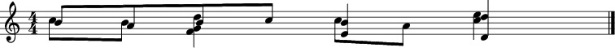
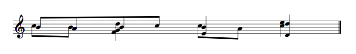
### [dotted-5.mei](MEI-test-set/MEI/chords/dotted-5.mei)
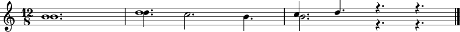

### [dotted.mei](MEI-test-set/MEI/chords/dotted.mei)
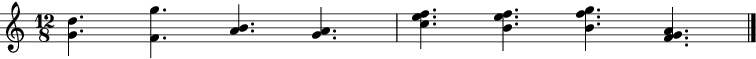
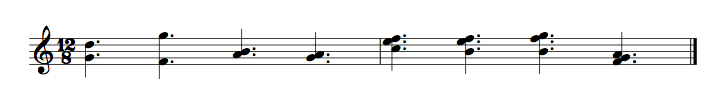
### [crossing-stems.mei](MEI-test-set/MEI/chords/crossing-stems.mei)

### [unisons.mei](MEI-test-set/MEI/chords/unisons.mei)
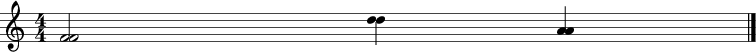

### [dotted-unison.mei](MEI-test-set/MEI/chords/dotted-unison.mei)
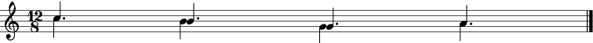

### [stem-directions-2.mei](MEI-test-set/MEI/chords/stem-directions-2.mei)
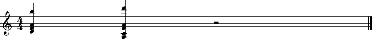

### [cluster-chords-2.mei](MEI-test-set/MEI/chords/cluster-chords-2.mei)
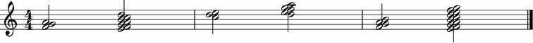
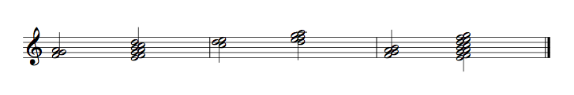
### [unisons-4.mei](MEI-test-set/MEI/chords/unisons-4.mei)
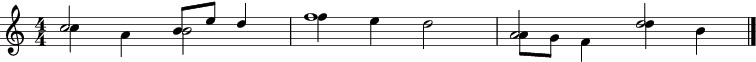

### [dotted-3.mei](MEI-test-set/MEI/chords/dotted-3.mei)
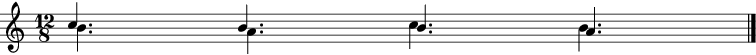

### [dotted-2-voiced.mei](MEI-test-set/MEI/chords/dotted-2-voiced.mei)
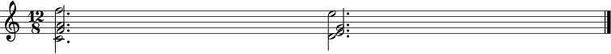

### [crossing-whole-notes.mei](MEI-test-set/MEI/chords/crossing-whole-notes.mei)
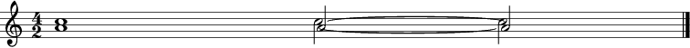

### [unisons-accidentals-chords.mei](MEI-test-set/MEI/chords/unisons-accidentals-chords.mei)
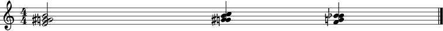

### [dynamic-placement.mei](MEI-test-set/MEI/dynamics/dynamic-placement.mei)
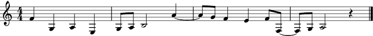

### [two-part-with-text.mei](MEI-test-set/MEI/dynamics/two-part-with-text.mei)
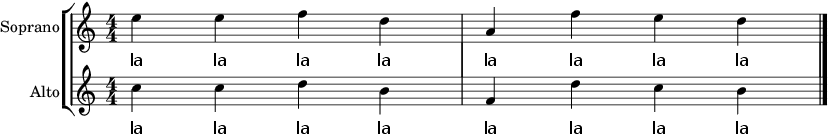

### [long-cresc.mei](MEI-test-set/MEI/dynamics/long-cresc.mei)

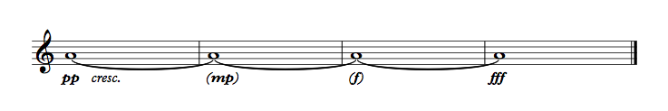
### [subito.mei](MEI-test-set/MEI/dynamics/subito.mei)
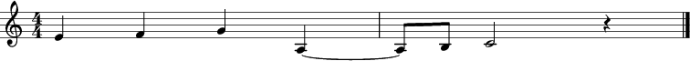

### [dynamics-1.mei](MEI-test-set/MEI/dynamics/dynamics-1.mei)

### [forte.mei](MEI-test-set/MEI/dynamics/forte.mei)

### [poco-molto.mei](MEI-test-set/MEI/dynamics/poco-molto.mei)
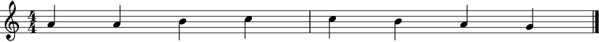
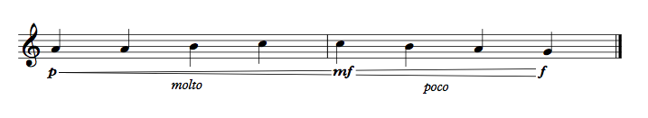
### [with-text.mei](MEI-test-set/MEI/dynamics/with-text.mei)

### [cresc-new-line.mei](MEI-test-set/MEI/dynamics/cresc-new-line.mei)
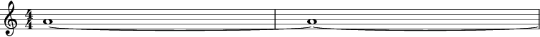
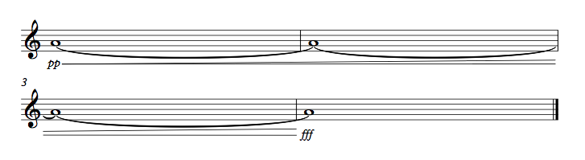
### [ties-overlapping-voices.mei](MEI-test-set/MEI/ties-slurs/ties-overlapping-voices.mei)

### [ties-2-voices.mei](MEI-test-set/MEI/ties-slurs/ties-2-voices.mei)
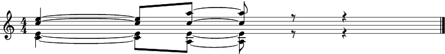

### [slurs-within-slurs.mei](MEI-test-set/MEI/ties-slurs/slurs-within-slurs.mei)

### [ties-chords.mei](MEI-test-set/MEI/ties-slurs/ties-chords.mei)
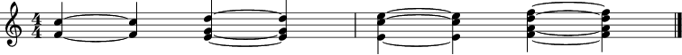

### [ties-chords-2.mei](MEI-test-set/MEI/ties-slurs/ties-chords-2.mei)

### [open-ties.mei](MEI-test-set/MEI/ties-slurs/open-ties.mei)
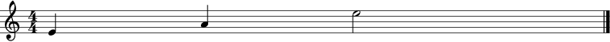

### [slured-chords.mei](MEI-test-set/MEI/ties-slurs/slured-chords.mei)
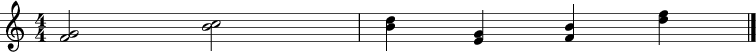

### [ties-stems.mei](MEI-test-set/MEI/ties-slurs/ties-stems.mei)
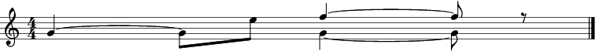

### [both.mei](MEI-test-set/MEI/ties-slurs/both.mei)
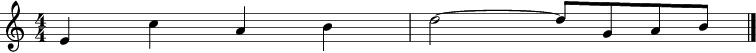

### [ties-dotted.mei](MEI-test-set/MEI/ties-slurs/ties-dotted.mei)
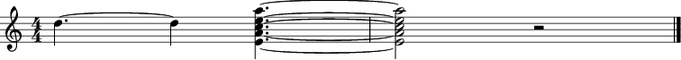

### [ties-unison.mei](MEI-test-set/MEI/ties-slurs/ties-unison.mei)
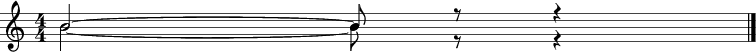

### [with-tenuto.mei](MEI-test-set/MEI/ties-slurs/with-tenuto.mei)

### [over-system.mei](MEI-test-set/MEI/ties-slurs/over-system.mei)
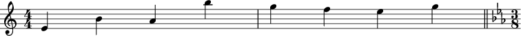

### [dotted-slur.mei](MEI-test-set/MEI/ties-slurs/dotted-slur.mei)

### [slurs-with-rests.mei](MEI-test-set/MEI/ties-slurs/slurs-with-rests.mei)
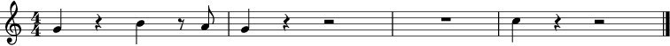

### [ties-with-other-notes.mei](MEI-test-set/MEI/ties-slurs/ties-with-other-notes.mei)

### [more-slurs.mei](MEI-test-set/MEI/ties-slurs/more-slurs.mei)

### [ties.mei](MEI-test-set/MEI/ties-slurs/ties.mei)
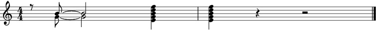

### [respelled.mei](MEI-test-set/MEI/ties-slurs/respelled.mei)
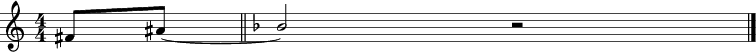

### [arpeggios.mei](MEI-test-set/MEI/arpeggios/arpeggios.mei)
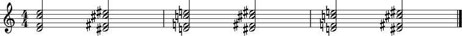

### [over-staves.mei](MEI-test-set/MEI/arpeggios/over-staves.mei)
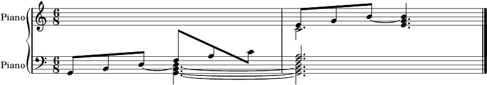

### [stop-start-arpegg.mei](MEI-test-set/MEI/arpeggios/stop-start-arpegg.mei)

### [written-out.mei](MEI-test-set/MEI/arpeggios/written-out.mei)
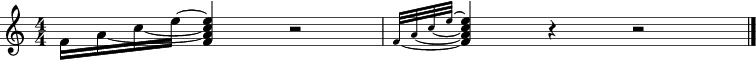

### [dynamics.mei](MEI-test-set/MEI/arpeggios/dynamics.mei)
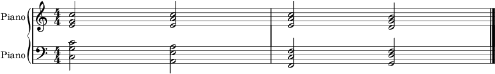

### [broken-arpegg.mei](MEI-test-set/MEI/arpeggios/broken-arpegg.mei)

### [vib-changes.mei](MEI-test-set/MEI/arpeggios/vib-changes.mei)

### [treble-down-8-cle-2.mei](MEI-test-set/MEI/clefs/treble-down-8-cle-2.mei)

### [bass-up-15-clef.mei](MEI-test-set/MEI/clefs/bass-up-15-clef.mei)

### [changing-clefs-2.mei](MEI-test-set/MEI/clefs/changing-clefs-2.mei)

### [percussion-clef.mei](MEI-test-set/MEI/clefs/percussion-clef.mei)

### [baritone-clef.mei](MEI-test-set/MEI/clefs/baritone-clef.mei)

### [treble-down-8-old-clef.mei](MEI-test-set/MEI/clefs/treble-down-8-old-clef.mei)

### [alto-clef.mei](MEI-test-set/MEI/clefs/alto-clef.mei)

### [changing-clefs-4.mei](MEI-test-set/MEI/clefs/changing-clefs-4.mei)

### [changing-clefs.mei](MEI-test-set/MEI/clefs/changing-clefs.mei)

### [treble-up-8.mei](MEI-test-set/MEI/clefs/treble-up-8.mei)

### [changing-clefs-6.mei](MEI-test-set/MEI/clefs/changing-clefs-6.mei)

### [bass-clef.mei](MEI-test-set/MEI/clefs/bass-clef.mei)

### [changing-clefs-5.mei](MEI-test-set/MEI/clefs/changing-clefs-5.mei)

### [baritone-bass-clef.mei](MEI-test-set/MEI/clefs/baritone-bass-clef.mei)

### [soprano-clef.mei](MEI-test-set/MEI/clefs/soprano-clef.mei)

### [sub-bass-clef.mei](MEI-test-set/MEI/clefs/sub-bass-clef.mei)

### [treble-down-8-clef.mei](MEI-test-set/MEI/clefs/treble-down-8-clef.mei)

### [changing-clefs-7.mei](MEI-test-set/MEI/clefs/changing-clefs-7.mei)

### [bass-up-8-clef.mei](MEI-test-set/MEI/clefs/bass-up-8-clef.mei)

### [tenor-clef.mei](MEI-test-set/MEI/clefs/tenor-clef.mei)

### [changing-clefs-3.mei](MEI-test-set/MEI/clefs/changing-clefs-3.mei)

### [bass-down-8-clef.mei](MEI-test-set/MEI/clefs/bass-down-8-clef.mei)

### [mezzo-soprano-clef.mei](MEI-test-set/MEI/clefs/mezzo-soprano-clef.mei)

### [treble-clef.mei](MEI-test-set/MEI/clefs/treble-clef.mei)

### [treble-up-15-clef.mei](MEI-test-set/MEI/clefs/treble-up-15-clef.mei)

### [french-violin-clef.mei](MEI-test-set/MEI/clefs/french-violin-clef.mei)

### [tuplets-2.mei](MEI-test-set/MEI/tuplets/tuplets-2.mei)

### [tuplets-articulation.mei](MEI-test-set/MEI/tuplets/tuplets-articulation.mei)

### [tuplets-articulation-2-parts.mei](MEI-test-set/MEI/tuplets/tuplets-articulation-2-parts.mei)

### [bracket-placement.mei](MEI-test-set/MEI/tuplets/bracket-placement.mei)

### [alignment.mei](MEI-test-set/MEI/tuplets/alignment.mei)

### [note-value.mei](MEI-test-set/MEI/tuplets/note-value.mei)

### [tuplets.mei](MEI-test-set/MEI/tuplets/tuplets.mei)

### [nested-tuplets.mei](MEI-test-set/MEI/tuplets/nested-tuplets.mei)

### [beamed-accentuation-2.mei](MEI-test-set/MEI/tuplets/beamed-accentuation-2.mei)

### [ratios.mei](MEI-test-set/MEI/tuplets/ratios.mei)

### [tuplet-brackets-2.mei](MEI-test-set/MEI/tuplets/tuplet-brackets-2.mei)

### [beamed-accentuation.mei](MEI-test-set/MEI/tuplets/beamed-accentuation.mei)

### [ratios-no-literal.mei](MEI-test-set/MEI/tuplets/ratios-no-literal.mei)

### [mixed-value.mei](MEI-test-set/MEI/tuplets/mixed-value.mei)

### [tuplet-brackets.mei](MEI-test-set/MEI/tuplets/tuplet-brackets.mei)

### [tuplets-two-parts.mei](MEI-test-set/MEI/tuplets/tuplets-two-parts.mei)

### [triplets.mei](MEI-test-set/MEI/tuplets/triplets.mei)

### [repeated-articulation.mei](MEI-test-set/MEI/articulations/repeated-articulation.mei)

### [artic-with-slurs.mei](MEI-test-set/MEI/articulations/artic-with-slurs.mei)

### [fermatas.mei](MEI-test-set/MEI/articulations/fermatas.mei)

### [ledger-lines.mei](MEI-test-set/MEI/articulations/ledger-lines.mei)

### [dotted-and-staccato.mei](MEI-test-set/MEI/articulations/dotted-and-staccato.mei)

### [two-parts-articulation.mei](MEI-test-set/MEI/articulations/two-parts-articulation.mei)

### [multiple-dots.mei](MEI-test-set/MEI/articulations/multiple-dots.mei)

### [accents-up-and-down.mei](MEI-test-set/MEI/articulations/accents-up-and-down.mei)

### [stacc-up-and-down.mei](MEI-test-set/MEI/articulations/stacc-up-and-down.mei)

### [multiple-articulations.mei](MEI-test-set/MEI/articulations/multiple-articulations.mei)

### [staccato-simile.mei](MEI-test-set/MEI/articulations/staccato-simile.mei)

### [artic-on-whole.mei](MEI-test-set/MEI/articulations/artic-on-whole.mei)

### [articulations.mei](MEI-test-set/MEI/articulations/articulations.mei)

### [3-repeats.mei](MEI-test-set/MEI/repeats/3-repeats.mei)

### [repeats-positioning.mei](MEI-test-set/MEI/repeats/repeats-positioning.mei)

### [changes-after-repeats.mei](MEI-test-set/MEI/repeats/changes-after-repeats.mei)

### [repeat-with-endings.mei](MEI-test-set/MEI/repeats/repeat-with-endings.mei)

### [mid-bar-repeat.mei](MEI-test-set/MEI/repeats/mid-bar-repeat.mei)

### [coda.mei](MEI-test-set/MEI/repeats/coda.mei)

### [da-capo.mei](MEI-test-set/MEI/repeats/da-capo.mei)

### [dal-segno.mei](MEI-test-set/MEI/repeats/dal-segno.mei)

### [simple-repeat.mei](MEI-test-set/MEI/repeats/simple-repeat.mei)

### [second-time-difference.mei](MEI-test-set/MEI/repeats/second-time-difference.mei)

### [3-repeats-2.mei](MEI-test-set/MEI/repeats/3-repeats-2.mei)

### [repeated-bars.mei](MEI-test-set/MEI/repeats/repeated-bars.mei)

### [tied-notes.mei](MEI-test-set/MEI/accidentals/tied-notes.mei)

### [quarter-tones.mei](MEI-test-set/MEI/accidentals/quarter-tones.mei)

### [two-stem-chords.mei](MEI-test-set/MEI/accidentals/two-stem-chords.mei)

### [alto-clef.mei](MEI-test-set/MEI/accidentals/alto-clef.mei)

### [cancellation-repeated-notes.mei](MEI-test-set/MEI/accidentals/cancellation-repeated-notes.mei)

### [placement-other-symbols.mei](MEI-test-set/MEI/accidentals/placement-other-symbols.mei)

### [respelling.mei](MEI-test-set/MEI/accidentals/respelling.mei)

### [altered-unisons-2.mei](MEI-test-set/MEI/accidentals/altered-unisons-2.mei)

### [bass-clef.mei](MEI-test-set/MEI/accidentals/bass-clef.mei)

### [two-parts-cancelled.mei](MEI-test-set/MEI/accidentals/two-parts-cancelled.mei)

### [accidental-coverage.mei](MEI-test-set/MEI/accidentals/accidental-coverage.mei)

### [big-chords.mei](MEI-test-set/MEI/accidentals/big-chords.mei)

### [unconventional-key-sig.mei](MEI-test-set/MEI/accidentals/unconventional-key-sig.mei)

### [tenor-clef.mei](MEI-test-set/MEI/accidentals/tenor-clef.mei)

### [grace-notes.mei](MEI-test-set/MEI/accidentals/grace-notes.mei)

### [treble-clef.mei](MEI-test-set/MEI/accidentals/treble-clef.mei)

### [all-accidentals.mei](MEI-test-set/MEI/accidentals/all-accidentals.mei)

### [cancellation.mei](MEI-test-set/MEI/accidentals/cancellation.mei)

### [octave-displacement.mei](MEI-test-set/MEI/accidentals/octave-displacement.mei)

### [altered-unisons.mei](MEI-test-set/MEI/accidentals/altered-unisons.mei)

### [tempo-alterations-2.mei](MEI-test-set/MEI/meter/tempo-alterations-2.mei)

### [dotted-notes.mei](MEI-test-set/MEI/meter/dotted-notes.mei)

### [fermatas.mei](MEI-test-set/MEI/meter/fermatas.mei)

### [scale-beaming.mei](MEI-test-set/MEI/meter/scale-beaming.mei)

### [new-rhythm.mei](MEI-test-set/MEI/meter/new-rhythm.mei)

### [beams-over-rests.mei](MEI-test-set/MEI/meter/beams-over-rests.mei)

### [all-groupings.mei](MEI-test-set/MEI/meter/all-groupings.mei)

### [more-beaming-5.mei](MEI-test-set/MEI/meter/more-beaming-5.mei)

### [triplet-test.mei](MEI-test-set/MEI/meter/triplet-test.mei)

### [fermata-parts.mei](MEI-test-set/MEI/meter/fermata-parts.mei)

### [more-beaming.mei](MEI-test-set/MEI/meter/more-beaming.mei)

### [quadruple-dotted.mei](MEI-test-set/MEI/meter/quadruple-dotted.mei)

### [polymeter.mei](MEI-test-set/MEI/meter/polymeter.mei)

### [note-head-denominator.mei](MEI-test-set/MEI/meter/note-head-denominator.mei)

### [beamings.mei](MEI-test-set/MEI/meter/beamings.mei)

### [changing-meters.mei](MEI-test-set/MEI/meter/changing-meters.mei)

### [variable-stress.mei](MEI-test-set/MEI/meter/variable-stress.mei)

### [multimeasure-rests.mei](MEI-test-set/MEI/meter/multimeasure-rests.mei)

### [structural-beaming.mei](MEI-test-set/MEI/meter/structural-beaming.mei)

### [rest-groupings-2.mei](MEI-test-set/MEI/meter/rest-groupings-2.mei)

### [old-measure-groups.mei](MEI-test-set/MEI/meter/old-measure-groups.mei)

### [fermata-positioning.mei](MEI-test-set/MEI/meter/fermata-positioning.mei)

### [measure-rests.mei](MEI-test-set/MEI/meter/measure-rests.mei)

### [beat-division.mei](MEI-test-set/MEI/meter/beat-division.mei)

### [more-beaming-3.mei](MEI-test-set/MEI/meter/more-beaming-3.mei)

### [beat-division-2.mei](MEI-test-set/MEI/meter/beat-division-2.mei)

### [syncopation.mei](MEI-test-set/MEI/meter/syncopation.mei)

### [tempo-indications.mei](MEI-test-set/MEI/meter/tempo-indications.mei)

### [rest-positions.mei](MEI-test-set/MEI/meter/rest-positions.mei)

### [metric-modulation.mei](MEI-test-set/MEI/meter/metric-modulation.mei)

### [feathered-beams.mei](MEI-test-set/MEI/meter/feathered-beams.mei)

### [rest-groupings.mei](MEI-test-set/MEI/meter/rest-groupings.mei)

### [tempo-alterations.mei](MEI-test-set/MEI/meter/tempo-alterations.mei)

### [parentheses.mei](MEI-test-set/MEI/meter/parentheses.mei)

### [sustaining-across-beats.mei](MEI-test-set/MEI/meter/sustaining-across-beats.mei)

### [compound-beats.mei](MEI-test-set/MEI/meter/compound-beats.mei)

### [meter-changes.mei](MEI-test-set/MEI/meter/meter-changes.mei)

### [more-beaming-4.mei](MEI-test-set/MEI/meter/more-beaming-4.mei)

### [rest-groupings-3.mei](MEI-test-set/MEI/meter/rest-groupings-3.mei)

### [more-beaming-2.mei](MEI-test-set/MEI/meter/more-beaming-2.mei)

### [2-4.mei](MEI-test-set/MEI/meter/2-4.mei)

### [beaming-over-beats.mei](MEI-test-set/MEI/meter/beaming-over-beats.mei)

### [glissando.mei](MEI-test-set/MEI/gliss/glissando.mei)

### [short-gliss.mei](MEI-test-set/MEI/gliss/short-gliss.mei)

### [gliss-precision.mei](MEI-test-set/MEI/gliss/gliss-precision.mei)

### [more-gliss.mei](MEI-test-set/MEI/gliss/more-gliss.mei)

### [interim-pitches.mei](MEI-test-set/MEI/gliss/interim-pitches.mei)

### [one-line.mei](MEI-test-set/MEI/lyrics/one-line.mei)

### [stems-through-bar.mei](MEI-test-set/MEI/beams-and-stems/stems-through-bar.mei)

### [over-barlines.mei](MEI-test-set/MEI/beams-and-stems/over-barlines.mei)

### [two-stem-directions.mei](MEI-test-set/MEI/beams-and-stems/two-stem-directions.mei)

### [stem-directions.mei](MEI-test-set/MEI/beams-and-stems/stem-directions.mei)

### [beam-placement.mei](MEI-test-set/MEI/beams-and-stems/beam-placement.mei)

### [nested-beams.mei](MEI-test-set/MEI/beams-and-stems/nested-beams.mei)

### [stem-directions-2.mei](MEI-test-set/MEI/beams-and-stems/stem-directions-2.mei)

### [beam-placement-2.mei](MEI-test-set/MEI/beams-and-stems/beam-placement-2.mei)

### [continuebeam-after-rest.mei](MEI-test-set/MEI/beams-and-stems/continuebeam-after-rest.mei)

### [one-line-staff.mei](MEI-test-set/MEI/staves/one-line-staff.mei)

### [two-line-staff.mei](MEI-test-set/MEI/staves/two-line-staff.mei)

### [three-line-staff.mei](MEI-test-set/MEI/staves/three-line-staff.mei)

### [beam-test.mei](MEI-test-set/MEI/additional-tests/beam-test.mei)

### [dynamic-placement.mei](MEI-test-set/MEI/grace-notes/dynamic-placement.mei)

### [fixed-slurs.mei](MEI-test-set/MEI/grace-notes/fixed-slurs.mei)

### [over-bar.mei](MEI-test-set/MEI/grace-notes/over-bar.mei)

### [slur-placement.mei](MEI-test-set/MEI/grace-notes/slur-placement.mei)

### [artic-on-grace-notes.mei](MEI-test-set/MEI/grace-notes/artic-on-grace-notes.mei)

### [grace-notes.mei](MEI-test-set/MEI/grace-notes/grace-notes.mei)

### [more-articulation.mei](MEI-test-set/MEI/grace-notes/more-articulation.mei)

### [two-parts-aligned.mei](MEI-test-set/MEI/grace-notes/two-parts-aligned.mei)

### [two-voice-grace-notes.mei](MEI-test-set/MEI/grace-notes/two-voice-grace-notes.mei)

### [time-signature-changes.mei](MEI-test-set/MEI/scores-and-layout/time-signature-changes.mei)

### [key-and-time-signature-changes.mei](MEI-test-set/MEI/scores-and-layout/key-and-time-signature-changes.mei)

### [key-signature-changes.mei](MEI-test-set/MEI/scores-and-layout/key-signature-changes.mei)

### [trill-speeds.mei](MEI-test-set/MEI/trills/trill-speeds.mei)

### [trill-length.mei](MEI-test-set/MEI/trills/trill-length.mei)

### [trills-accidentals.mei](MEI-test-set/MEI/trills/trills-accidentals.mei)

### [trills.mei](MEI-test-set/MEI/trills/trills.mei)

### [note-change.mei](MEI-test-set/MEI/trills/note-change.mei)

### [trills-with-grace-notes.mei](MEI-test-set/MEI/trills/trills-with-grace-notes.mei)

### [multiple-voiced-trill.mei](MEI-test-set/MEI/trills/multiple-voiced-trill.mei)

